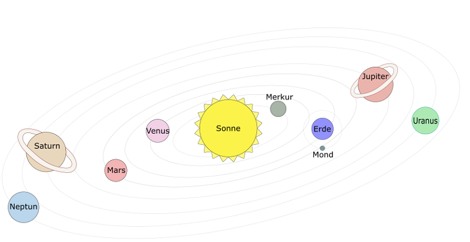
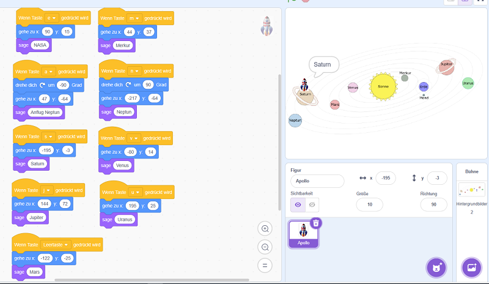
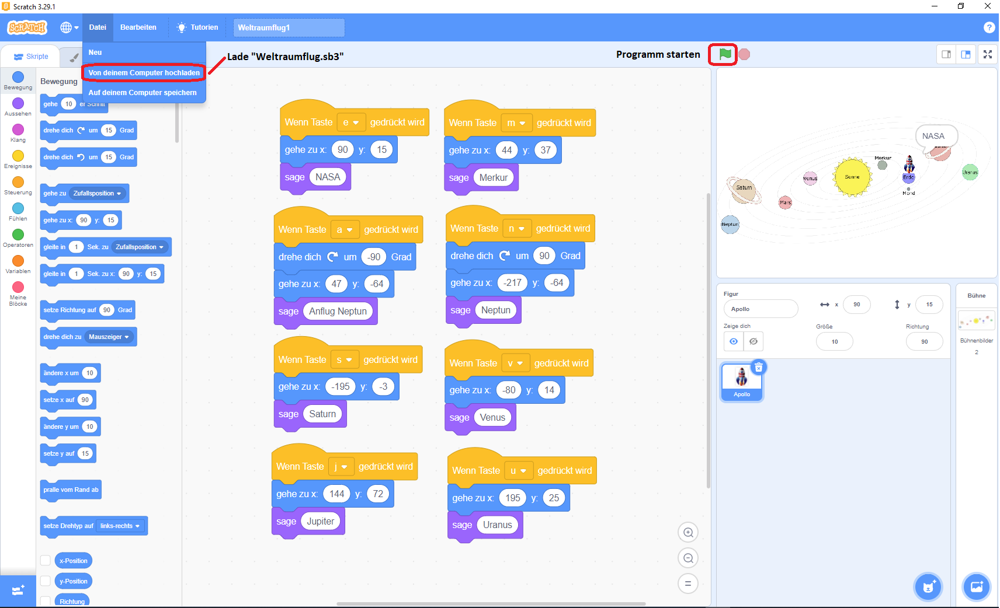

|[:skull:ISSUE](https://github.com/frankyhub/Space-Scratch/issues?q=is%3Aissue)|[:speech_balloon: Forum /Discussion](https://github.com/frankyhub/Space-Scratch/discussions)|[:grey_question:WiKi](https://github.com/frankyhub/Space-Scratch/wiki)||
|--|--|--|--|
| | | | |
||<a href="https://github.com/frankyhub/Space-Scratch/issues">|<a href="https://github.com/frankyhub/Space-Scratch/discussions">|<a href="https://github.com/frankyhub/Space-Scratch/releases">|
|| <a href="https://github.com/frankyhub/Space-Scratch/pulse" alt="Activity">| <a href="https://github.com/frankyhub/Space-Scratch/graphs/traffic">  |<a href="https://github.com/frankyhub?tab=stars"> |

## Story
Scratch ist eine einfache, visuelle Programmiersprache, mit der ganz einfach digitale Geschichten, Spiele und Animationen erstellt werden können. Die Scratch Foundation, eine Non-Profit-Organisation, designt, entwickelt und moderiert Scratch.

Link: https://scratch.mit.edu/

Das Beispiel zeigt einen Flug durch unser Sonnensystem. Mit den Tasten E (Erde), M (Merkur), N (Neptun), S (Saturn), V (Venus), J (Jupiter) und U (Uranus) werden die Planeten mit der Apollo angeflogen.
Das Bild Sonnensystem.png dient als Hintergrund.

Hintergrund:

Programm:

Starte:

---

   
<ol class="breadcrumb" style="border-top: 2px solid black;border-bottom:2px solid black; height: 45px; width: 900px;"> 
<a href="#oben">nach oben</a>
</ol>

  

---
